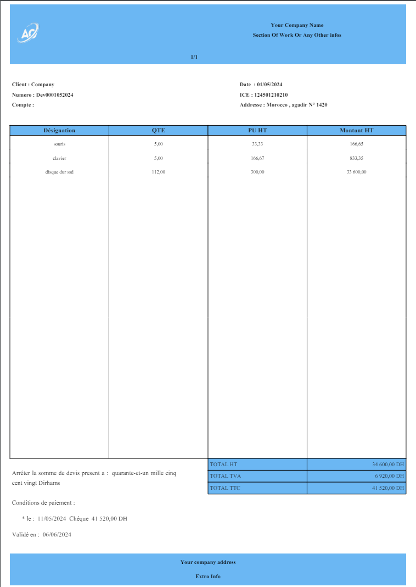

<h1>Fpdf_invoices</h1>

FPDF-Invoice is a class based on the FPDF library, designed to simplify the creation of invoices and PDF files. This package offers a robust and flexible solution for generating professional PDF invoices, with the ability to customize any part of the PDF to meet your specific requirements. Whether you need to create simple invoices or detailed documents, FPDF-Invoice provides the tools and flexibility you need.

<h2> Key Features: </h2>

Simple Integration :

Easily integrate with your existing PHP projects.
Minimal setup required to start creating invoices.
Customizable Templates:

Fully customizable invoice layouts.
Add custom headers, footers, logos, and other sections to fit your branding.
Itemized Invoices:

Add multiple line items with descriptions, quantities, and unit prices.
Automatic calculation of subtotals, taxes, and total amounts.
Flexible Styling:

Customize fonts, colors, and styles.
Modify any part of the PDF to meet your design requirements.
Multi-Currency and Localization:

Support for various currencies and date formats.
Easily localize text for different languages and regions.
PDF Generation:

High-quality PDF output with options for saving, downloading, or emailing the invoice.
Utilizes FPDF's robust rendering capabilities for reliable performance.
Extensible Design:

Easily extend and modify functionality to suit specific business needs.
Hooks and filters available for advanced customizations.
Comprehensive Documentation:

Detailed documentation with installation instructions and usage examples.
Step-by-step guides to help you get started quickly.
Installation:

Install FPDF-Invoice via Composer:

<em>composer require deuxrtmaroc/fpdf_invoice</em> 

<h4>Preview : </h4>

